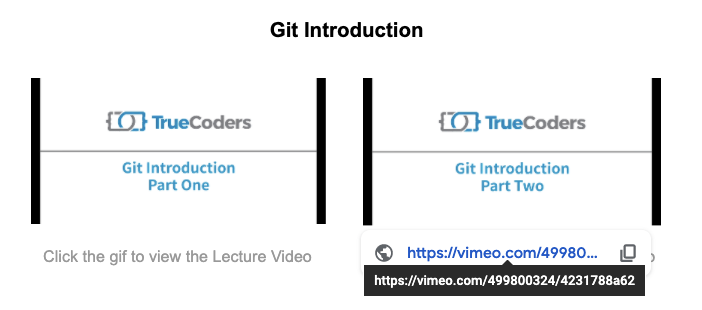
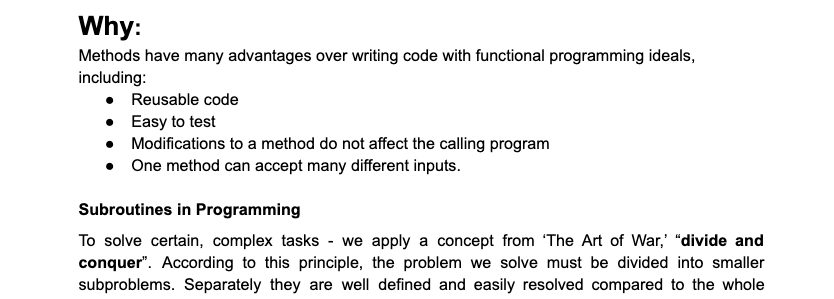
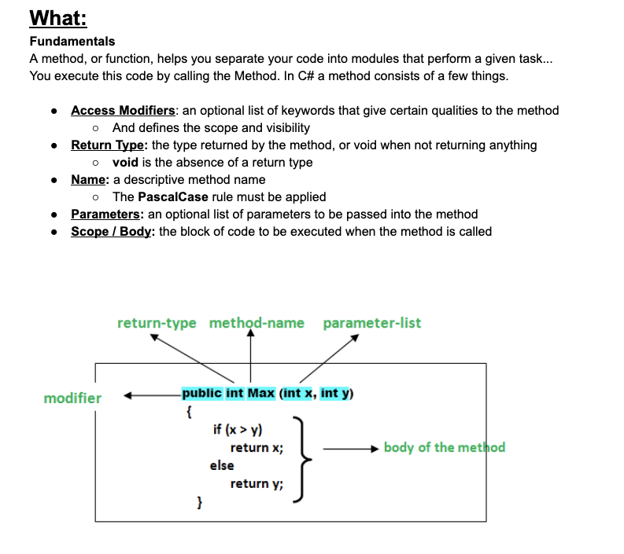
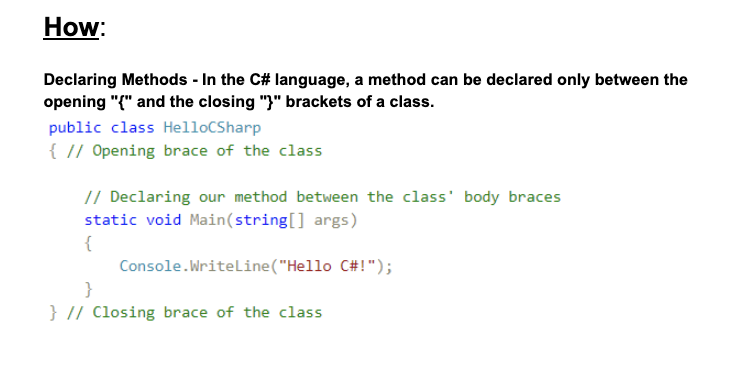
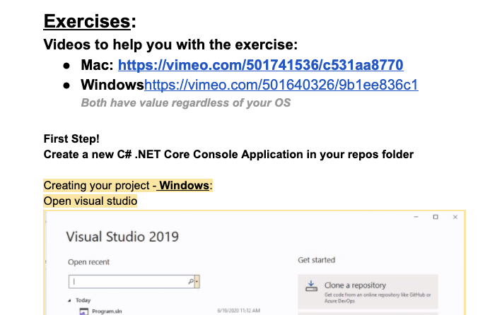

# **TrueCoders Class Introduction**

## Welcome to class!  Before we get started, let’s breakdown the format and flow of the class.

- **Lecture Material:** Your course will consist of Lecture Material Documents

- **Lecture Videos:** Each document will begin with **Lecture Videos** that look like this

## As you can see above, by clicking on the gif (moving image) you can access the Lecture Video

**Let’s try it on this example:**

Click the gif to access the video

# **Why Section:**

# After the Lecture Videos, the **Why** sections explains why we teach this topic and maybe even some history on the topic

# **What Section:**

# This area of the Lecture Material will cover the theory of the topic.  This will consist of definitions and important terms that should be studied

# **How Section:**

## In the **How** section, we will show you how the code or topic operates.  This will include screenshots and step by step breakdowns

# **Exercise Section:**

## In this section, we take what we’ve learned and implement it!  The **Exercise section** will include videos that explain how to complete each exercise.  We also include written steps that we think will be helpful

# **Quiz:**

## Finally, we conclude the lesson with a quiz.  Quizzes are important for retention and repetition of the topics covered.
- **First**, you will Take The Quiz
- **Second**, you can watch the video that explains the quiz answers

### Here’s an example of what that will look like:

<table>
  <tr>
   <td><strong><a href="https://forms.gle/b5QoTSZ4Xq1YhzFe9">Take the Method Quiz Now</a></strong>
   </td>
  </tr>
  <tr>
   <td>

   </td>
  </tr>
  <tr>
   <td><strong>Click the gif to watch the Quiz Recap Video</strong>
   </td>
  </tr>
</table>

