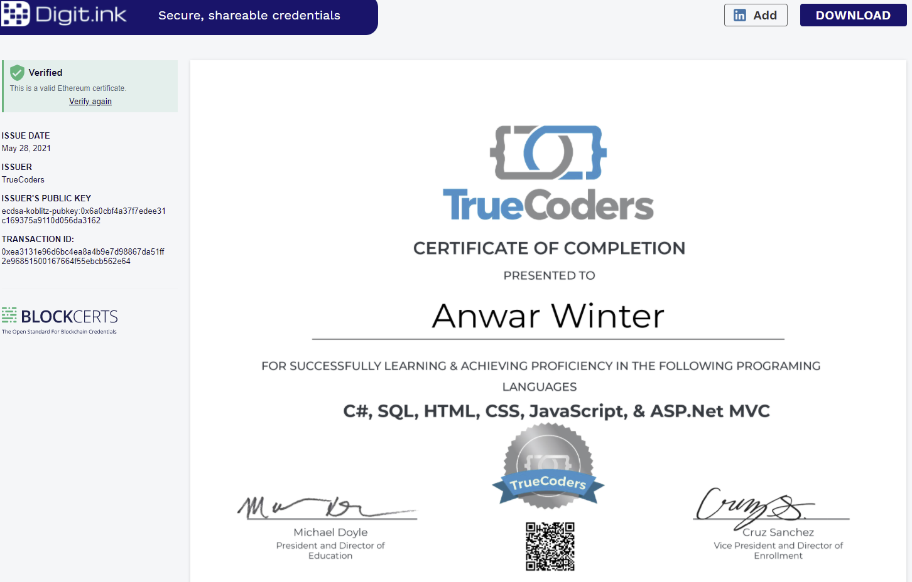
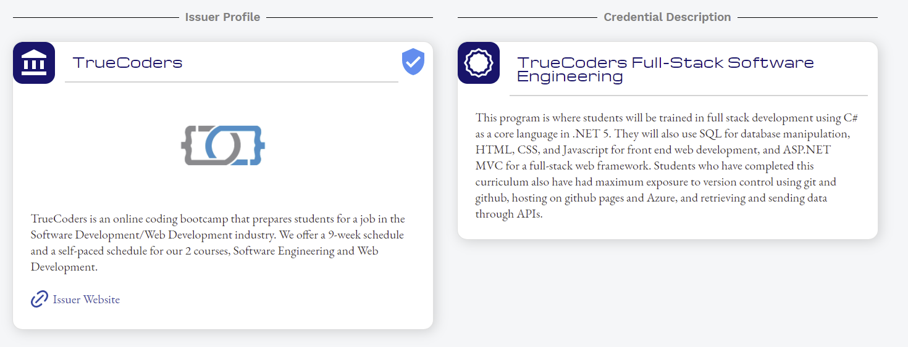
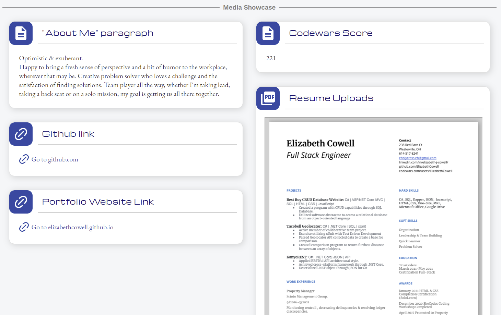
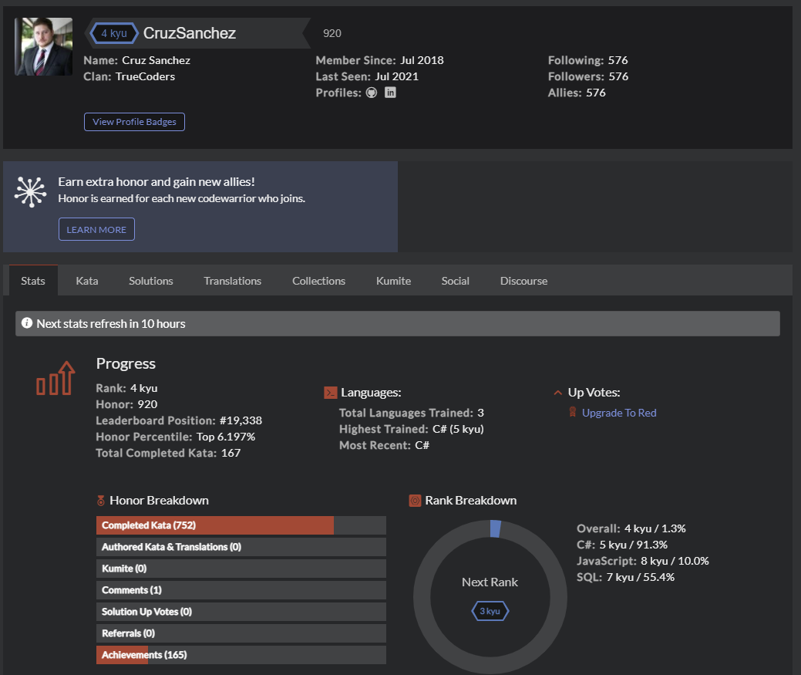
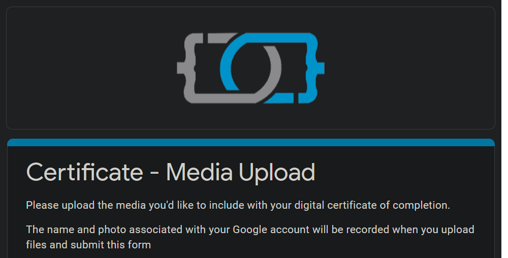

# IMPORTANT:

### **Your diploma from TrueCoders is sent to you as an NFT (Non-Fungible Token). Because this is a digital file you can customize it with pics and videos, links to your GitHub or portfolio website, your Codewars score, and have an About Me section. Please fill out the Google form attached in the link below so we can get your diploma made as soon as possible.** 

Be Aware: NFTs cannot be changed after they are created. Be sure to include links that will stay the same (e.g. profile links or site URLs you own) so you won't have dead links in your Diploma later on. You can change the content on those links but your NFT Diploma will stay the same.
____
# TrueCoders NFT Credential

The purpose of this document is to help give you a better understanding of your verified credential upon completion of this course. TrueCoders now offers a NFT ([Non Fungible Token](https://en.wikipedia.org/wiki/Non-fungible_token)) certificate. We wanted to use this as our primary issuing credential because it will add value to the student’s experience here at TrueCoders by giving you extra power when searching for a job in the industry.

## **Main Credential:**

Here we can see a preview of what your credential will look like. Starting from the top, we can see that the credential is administered through Digit.ink. They are the ones who create the NFT on the Ethereum Blockchain.

To the far right of that there is a one click add to LinkedIn button. I advise you to do that as soon as you get access to the certificate. There is also a download button, you can download this as an image, a printable pdf, or the raw json file (not as essential). 

Moving down the page, you can see the green box on the left. This is where it tells you it is a 100% verified token through Ethereum. You can see the date the NFT was issued as well. 

In the middle of the page is the certification itself. This will not change other than it will have your name on it. Of course, it will have the correct class you are taking and the languages/technologies you have learned. 

The last part of the main credential is the QR code. If you have the printed version of the certification, anyone with a modern phone can scan that and it will take them to your personal page, Very Cool!

## **Issuer Profile:**

This area is pretty basic, it covers who TrueCoders is and what we do, as well as an overview of the course curriculum you took here (Software Engineering or Web Development).

## **Media:**

Now here is the fun part! You can have your credential and a portfolio all in one area! We give you the ability to add media to this NFT. This is of course 100% optional but we find it gives you the ability to be unique and separate yourself from everyone else in the job market. Anything you choose not to add will not show up at all, only the things you add will have a value for it.

Here is a complete list of every media item you can add:
1. Github link
2. Photos of your apps &#8592; not pictured
3. Videos of your apps &#8592; not pictured
4. Codewars profile link &#8592; not pictured
5. Portfolio Website Link
6. Resume link
7. An "About Me" paragraph	

The reason we have you provide links to most of these things, if not all by the time you fill yours out is because, once an NFT has been created it **CANNOT BE MODIFIED. ** Please make sure you have everything you can as dynamic links that you can change. As long as the link or URL doesn’t change it will still be relevant on your NFT. For your resume, you can upload it to your Google Drive and just put the direct link to the resume. For codewars go to the view profile link when you click on your picture at the top right. It will take you to a page like this:

Use the URL to this page for that media content. 

We hope you enjoy your credential and hope it helps assist you in the job search process. As always reach out to us in discord if you have any questions about this or DM me directly (Cruz Sanchez)

___
# &#8595; Click the Picture to Open the Form &#8595;
