# Unit Testing

**Why:**

All the time people ask, “Why on earth should we write code to test our application, when we can just run the application and see the result?”

So why testing? and what are the benefits of testing our application?

One of the biggest benefits of testing is being able to catch bugs before deploying the application!

Other benefits are:

* Deploying with confidence
* Refactoring your code, which means: changing the structure of your code without changing its behavior
* Focusing more on quality

**What:**

In Testing, we have 3 types of tests:

1. Unit Tests
    1. This tests a unit of an application without its external dependencies
    2. They’re cheap to write and they execute quickly
    3. However, due to the lack of dependencies used, they don't offer much confidence
2. Integration Tests
    4. Tests a class or component of an application with the use of its external dependencies
    5. Typically take longer to execute, and offer more confidence in the health of our application
3. End-to-end tests
    6. Drive an application through its UI
    7. A popular example that fits this category is Selenium
    8. Give the greatest amount of confidence
    9. Very slow
    10. Very brittle, one small change in the UI can easily break these types of test

So what type of test should we write in our application? 

All of them!

This is what we call the test pyramid!

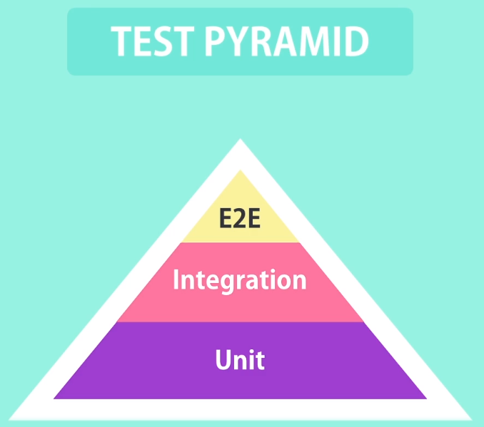

Most of our tests should be in the category of unit tests since these are easier to write and execute tests. 

However since they don’t offer a lot of confidence, we should also have Integration tests, allowing us to use external dependencies to assist in testing our application.

Finally, we should write very few End to end tests to test the key components of our application

	**Takeaways:** Favor unit tests to E2E tests

			Cover unit test gaps with integration tests

			Use End-to-End tests sparingly

	Tooling

	In order to write tests, we need a test framework, which is essentially a library that gives us a bunch of utility functions in order to write tests effectively and efficiently!

 

They also give a Test Runner, which in turn runs our tests and reports how many passed and/or failed!

The most popular frameworks for testing are:

1. Jasmine
    1. Jasmine was one of the early players in front end testing
    2. Doesn’t need any plugins
2. Mocha
    3. This is the more popular framework, however, it does not include a lot of features that are available in other libraries.
    4. To use Mocha effectively, you’ll need plugins, preferably either Chai or Sinon
3. Jest
    5. Jest is a newer framework and used by Facebook to test their applications
    6. It is essentially a wrapper around Jasmine, So knowing one means you mostly know the other
    7. Jest also comes with an extensive code coverage tool that is very useful
    8. We will use Jest in this course

	**Focus on the fundamentals, not the tools!**

**How:**

So the first thing we want to do is create a folder  and name it “testing-practice”

	In this folder on your terminal run: `npm init `this will create our much needed package.json so we can start adding the jest package.

All steps here:

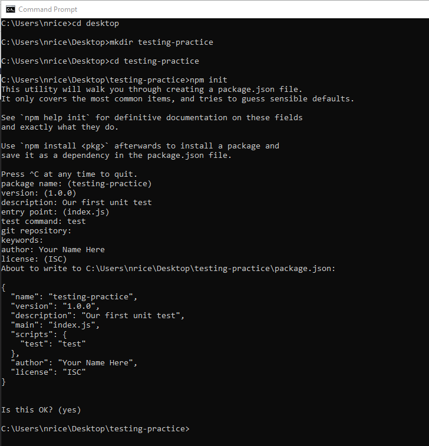

**	**

Next, we need to add the Jest package: `npm i jest`

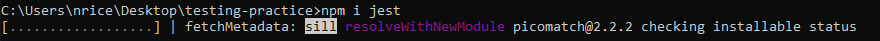

Next, in our package.json, take a look at our scripts object:

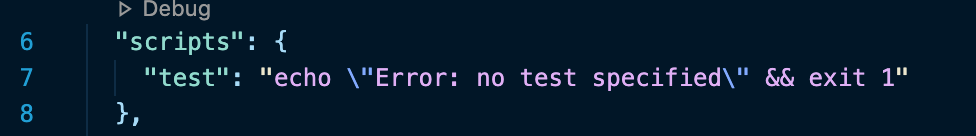

Currently, when we run our test script, it prints the above line.

We want our test command to actually run our jest testing tool, so replace the above line with “jest” and save:

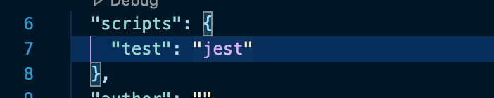

Next, let’s create a file called calculator.js.

Then create a folder called tests, and inside create a file called calculator.test.js:

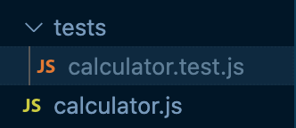

We’re going to be writing tests for an ‘add’ function, so first in our calculator.js, create a function called add:

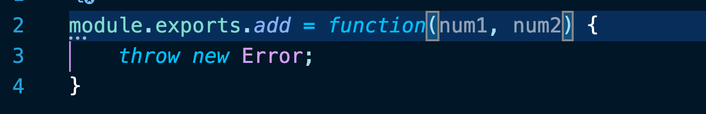

Now we can start writing our tests for our add function, type the following to create a stubbed out add function

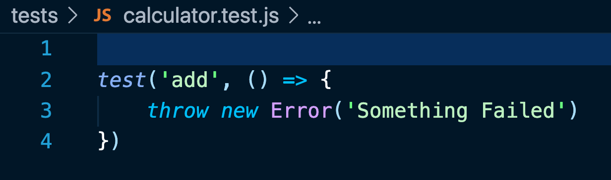

Next, we want to require our calculator file so we can call and test our function:

Then call our add function and pass two random numbers and store into a const result:

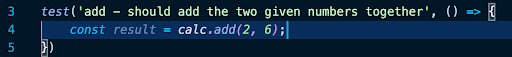

We will use the expected function and the toBe function to compare with what the function should return:

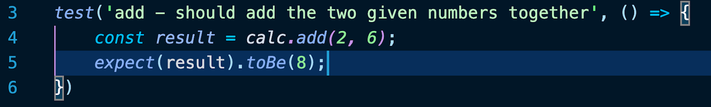

Now let’s go to our terminal and run npm test and we can see the test fail:

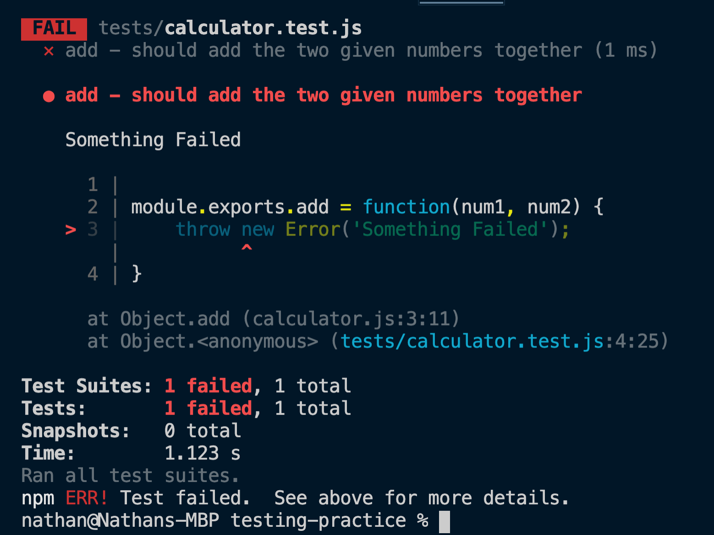

We can then write our code to pass:

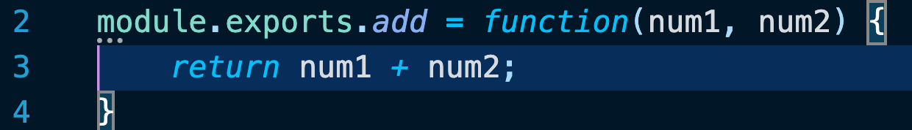

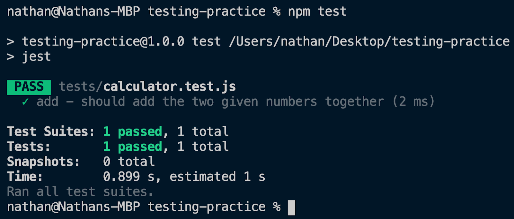

Now that our test is passing, let’s add some more tests:

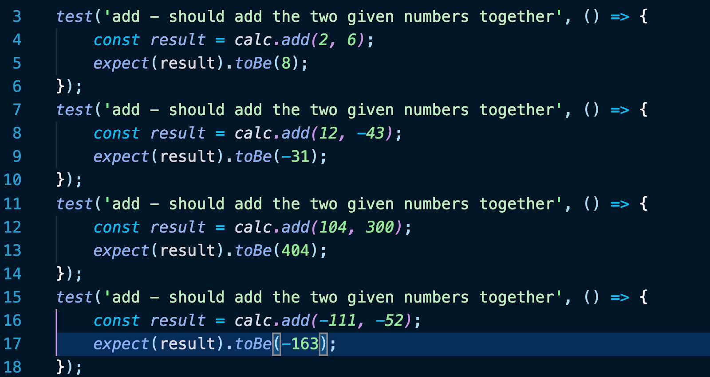

And then we’ll clean it up by refactoring:

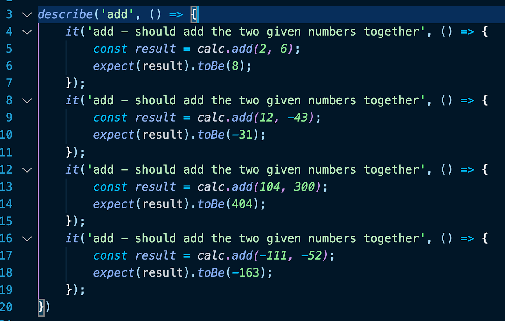

**Quiz:**

No Quiz
