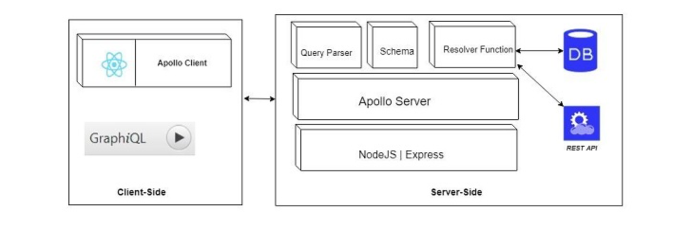

# GraphQL

## Why

RESTful API fetches can deal with complex and multi-layered data. Plus, if you work with APIs long enough, you realize that often you must call an API multiple times to fetch all of your required data. 

GraphQL is designed to simplify and enhance data fetching and manipulation. You can use GraphQL queries to access specific data and data relations to simplify and reduce queries.

## What

GraphQL is a query language for your API and your data. It is defined as an “application layer server-side technology” that allows you to execute queries with your existing data. It is serviced with a type system for specifying return values and can be written in any language using **Schema Definition Language (SDL)**, part of which has led to its wide usage. GraphQL was developed by Facebook in 2012.

## How

GraphQL is an efficient data access layer for your server that fetches requested data. 

Three important server-side tools are:

* **Schema** => A definition for what kind of object can be fetched from a service, and what properties it has.
* **Query** =>** **a request to retrieve data from a database or RESTful API's.
* **Resolver** => a set of instructions for turning a GraphQL operation into data by defining resolver functions.

Two important client-side tools are:

* **GraphiQL** => Powerful and intelligent browser interface for editing and testing and validating GraphQL queries.
* **ApolloClient** => Client tool for building GraphQL client applications that works well with JavaScript frontends.

The architecture resembles:

### Example

SWAPI RESTful API vs. SWAPI GraphQL Data Access Layer

READING RESOURCE: [Introduction to GraphQL | GraphQL](https://graphql.org/learn/)
