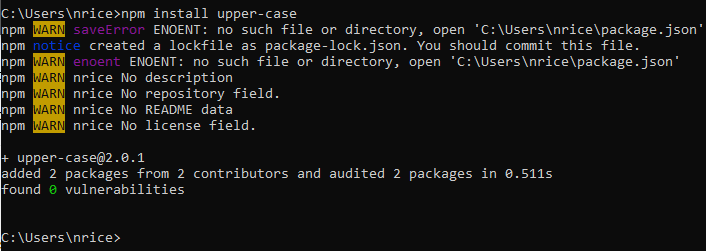
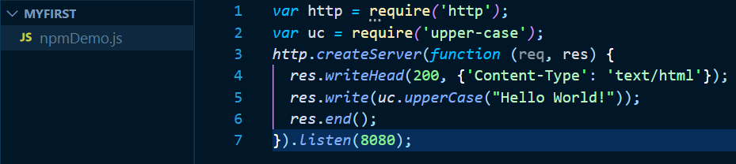
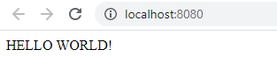

**Node.js NPM**


**<span style="text-decoration:underline;">Why:</span>**


## What is NPM?

**NPM is a package manager for Node.js packages, or modules if you like.**

**[www.npmjs.com](https://www.npmjs.com/) hosts thousands of free packages to download and use.**

**The NPM program is installed on your computer when you install Node.js**


**<span style="text-decoration:underline;">What</span>:**


## **What is a Package?**

A package in Node.js contains all the files you need for a module.

Modules are JavaScript libraries you can include in your project.


## **Download a Package**

Downloading a package is very easy.

Open the command line interface and tell NPM to download the package you want.

I want to download a package called "upper-case":





Now you have downloaded and installed your first package!

NPM creates a folder named "node_modules", where the package will be placed. All packages you install in the future will be placed in this folder.

My project now has a folder structure like this:


```
C:\Users\nrice\node_modules\upper-case
```


## **Using a Package**

Once the package is installed, it is ready to use.

Include the "upper-case" package the same way you include any other module:


```
var uc = require('upper-case');
```


Create a Node.js file that will convert the output "Hello World!" into upper-case letters:





Result:





**<span style="text-decoration:underline;">Quiz</span>:**

**Questions that pertain to the lesson** (you may reintroduce questions missed from previous quizzes) 

<span style="text-decoration:underline;">Create Google Quizzes in this Drive Folder:</span> [https://drive.google.com/open?id=1fn1rhoUXs_q6_NeKrgvNtILTPkjHpEWg](https://drive.google.com/open?id=1fn1rhoUXs_q6_NeKrgvNtILTPkjHpEWg)
