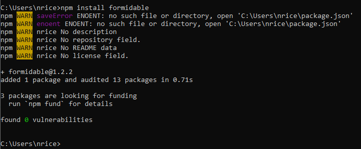
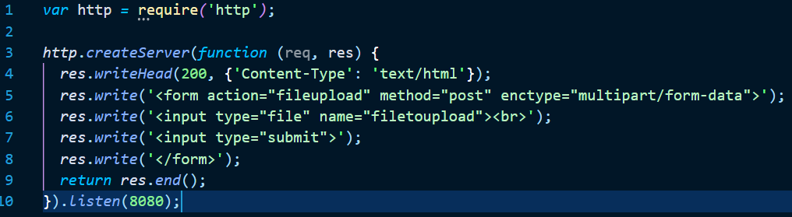
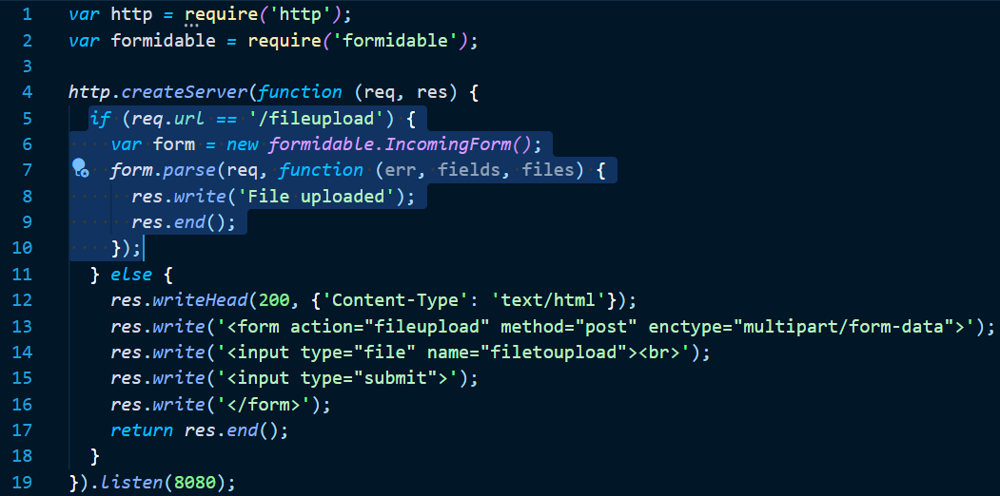
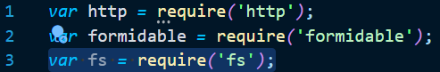
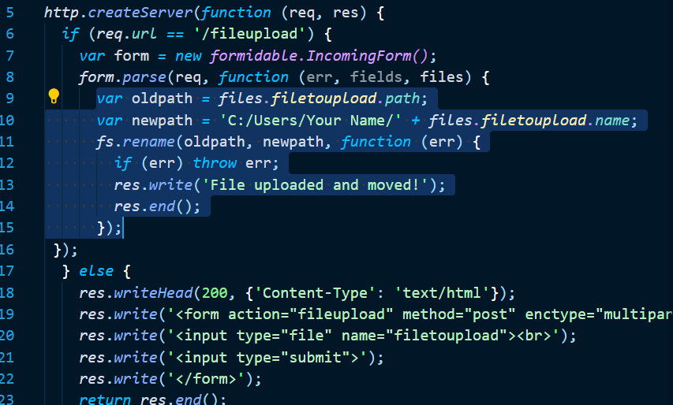

**Node.js Upload Files**


**<span style="text-decoration:underline;">Why:</span>**


    File uploading means a user from client machine requests to upload files to the server. For example, users can upload images, videos, etc on Facebook, Instagram, etc. 


    So you can see why this may be important to be able to do


**<span style="text-decoration:underline;">What</span>:**


## **The Formidable Module**

There is a very good module for working with file uploads, called "Formidable".

The Formidable module can be downloaded and installed using NPM:





After you have downloaded the Formidable module, you can include the module in any application:


```
var formidable = require('formidable');
```


**<span style="text-decoration:underline;">How</span>:**


## **Upload Files**

Now you are ready to make a web page in Node.js that lets the user upload files to your computer:


## **Step 1: Create an Upload Form**

Create a Node.js file that writes an HTML form, with an upload field:





## **Step 2: Parse the Uploaded File**

Include the Formidable module to be able to parse the uploaded file once it reaches the server.

When the file is uploaded and parsed, it gets placed on a temporary folder on your computer.





## **Step 3: Save the File**

When a file is successfully uploaded to the server, it is placed on a temporary folder.

The path to this directory can be found in the "files" object, passed as the third argument in the `parse()` method's callback function.

To move the file to the folder of your choice, use the File System module, and rename the file:




<




**<span style="text-decoration:underline;">Quiz</span>:**

**Quiz to be assigned in Google Classroom**
