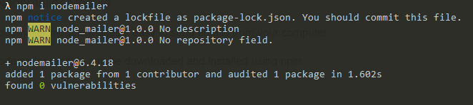
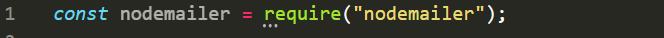
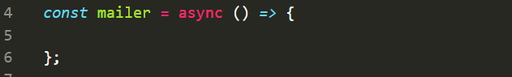
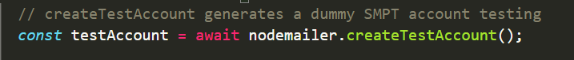
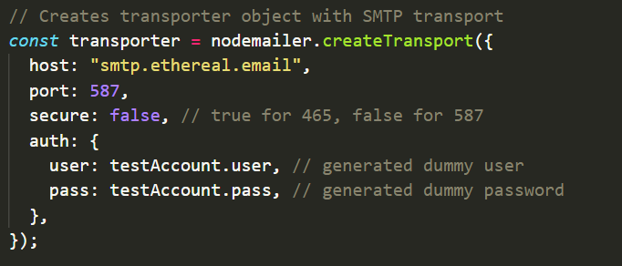
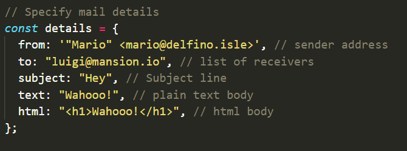
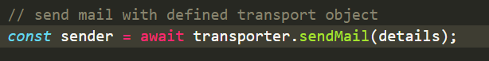
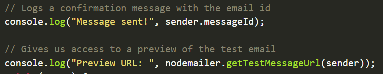
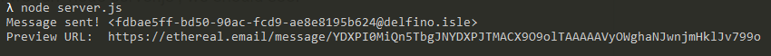
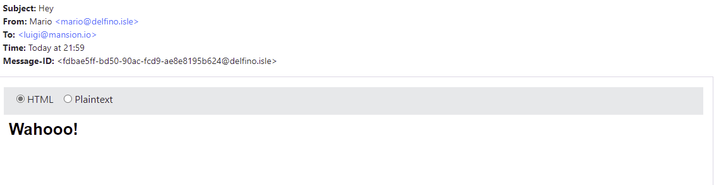

# Node.js Emailer

## Why:

In the world of today, most things are communicated via email. Whether it's a notification or your boss requesting information from you. But how does the email system work when it comes to sending emails from your server or possibly another source. Let's take a look at this via Node.js

SMTP is the main transport in Nodemailer for delivering messages. SMTP is also the protocol used between different email hosts, so it's truly universal. Almost every email delivery provider supports SMTP based sending, even if they mainly push their API based sending. APIs might have more features but using these also means vendor lock-in while in case of SMTP you only need to change the configuration options to replace one provider with another and you’re good to go.

-----

What is SMTP? “The Simple Mail Transfer Protocol (SMTP) is a communication protocol for electronic mail transmission...”

## What:

### The Nodemailer Module

The Nodemailer module makes it easy to send emails from your computer.

The Nodemailer module can be downloaded and installed using npm:

After you have downloaded the Nodemailer module, you can include the module in any application:

**	**

Now you are ready to send emails from your server.

## How:

### Send an Email

For the walkthrough, we’ll be demonstrating how to use nodemailer with test accounts. At the end, we’ll show you how to quickly translate the testing walkthrough for your own emails.

In a new project folder, create a ‘server.js’ file.

Inside of server.js, let’s create an asynchronous function named ‘mailer’.

We will be using a test email account, so create a variable ‘testAccount’ and use ‘nodemailer.createTestAccount()’ to generate our dummy account.

Next, we’ll need a transporter object to send emails. We will use ‘nodemailer.createTransport()’ and pass in transport details.

#### Transporter Object

* Transporter is going to be an object that is able to send mail

* Transport is the transport configuration object, connection url or a transport plugin instance

### Mail Data

Now let’s declare our mail options, These are things such as the “from” and “to” as well as the subject and body text:

Our details object specifies the sender email address, recipient address, text body, and html body. Officially, we have the following options that we may include with the mail details:

* **from**- the sender email address. Can be _email@gmail.com_ or _'“Jane Doe” jane@yahoo.com’_
* **to**- Comma separated list or an array of recipients email addresses that will appear on the _To:_ field
* **cc**- Comma separated list or an array of recipients email addresses that will appear on the _Cc:_ field
* **bcc**- Comma separated list or an array of recipients email addresses that will appear on the _Bcc:_ field
* **subject**- subject of the email
* **text**- plaintext version of the message
* **html**- HTML version of the message
* **attachments**- An array of attachment objects

### Sending mail

Now that we have a transporter object and mail details, we can send mail with it:

Since we’ve used a test account, we’ll need to use ethereal to view our test email preview. We can access a link to our preview by logging nodemailer.getTestMessageUrl(sender):

When we run ‘node server.js’, we should see:

And if we navigate to the returned url:

### Refactoring for Non-test case

It’s pretty neat that we can send emails right from our node applications! But we need to _actually _send them instead of using test data. Let’s look at our example and start sending real emails!

...OAuth2?

## Quiz:

**Quiz to be assigned in Google Classroom**
