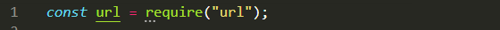
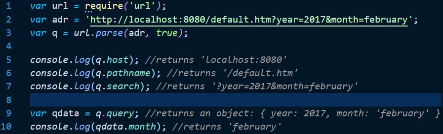

# Node.js URL Module

## Why:

URL Module in node. js provides functionality for URL utilities and parsing for the same. By using these many properties you can perform plenty of operations with your nodejs application specific to URL.

## What:

### The Built-in URL Module

The URL module splits up a web address into readable parts.

To include the URL module, use the require() method:

Parse an address with the url.parse() method, and it will return a URL object with each part of the address as properties:

url.parse() splits a web address into readable parts:

## How:

We use url parameters when dealing with html form post actions. Consider the following scenario. You are creating a form for the user to enter their name and email address. You display the form to the user, and prompt them to sign up for your newsletter because it’s awesome. You know how to create a pretty enticing form, and when the user submits their information, the form action is ‘post’, and sends the data…? Well up until now we haven’t worked with that. Let’s do that now.

## Quiz:

**Quiz to be assigned in Google Classroom**
